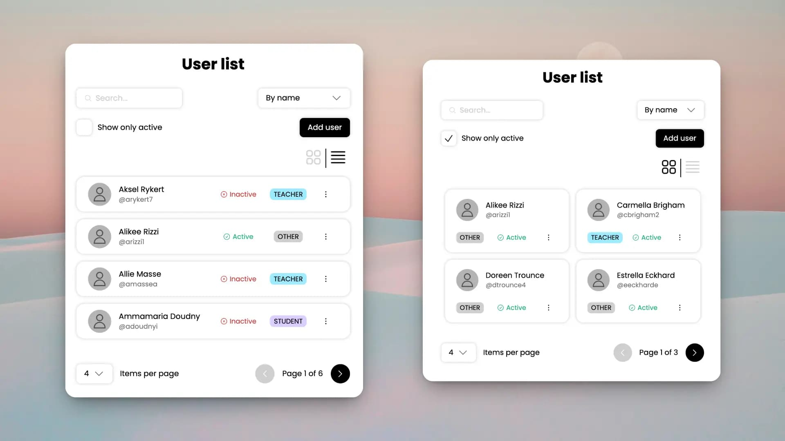

# React Users List 👥

This is a user management project built with **React** and **Vite**. It allows for full CRUD (Create, Read, Update, and Delete) operations on a users list, offering a modern and fluid user interface.



## 🚀 Features

- **Full User Management (CRUD):** Create, edit, view, and delete users.
- **Flexible Views:** Toggle between Grid and List views.
- **Advanced Filtering:** Search by name and filter by status/role.
- **Pagination:** Efficient handling of large datasets.
- **Visual Feedback:** Alert system and modals for action confirmation.
- **Modular Styling:** Uses CSS Modules for clean, collision-free design.

## 🛠️ Prerequisites

Before you begin, make sure you have installed:
- **Node.js** (Version 16 or higher recommended)
- **npm** (Comes with Node.js)

## 📦 Installation

1. Clone the repository:
   ```bash
   git clone https://github.com/IvanCsCz/react-users-list.git
   cd react-users-list
   ```

2. Install dependencies:
   ```bash
   npm install
   ```

## 💻 Running the Project

The project uses a mock data server (`json-server`) and a development server for the frontend.

### 1. Start the Data Server (API)
In a terminal, run:
```bash
npm run server
```
*The server will be available at `http://localhost:4000`.*

### 2. Start the Application (Frontend)
In **another** terminal, run:
```bash
npm run dev
```
*The application will open in your browser (usually at `http://localhost:5173`).*

---

## 📂 Project Structure

- `src/components/`: Reusable UI components.
- `src/lib/`: Business logic, custom hooks, reducers, and API.
- `src/constants/`: Global constants and configurations.
- `src/styles/`: Global themes and CSS resets.
- `users.json`: Local database for the server.

## 🛠️ Other Available Scripts

- `npm run build`: Compiles the application for production.
- `npm run format`: Formats code using Prettier.
- `npm run lint`: Runs the linter to find and fix style errors.
- `npm run preview`: Previews the production build locally.

## 🔧 Technologies Used

- **React 18**
- **Vite** (Build tool)
- **JSON Server** (Mock API)
- **CSS Modules**
- **ESLint & Prettier** (Code quality)
